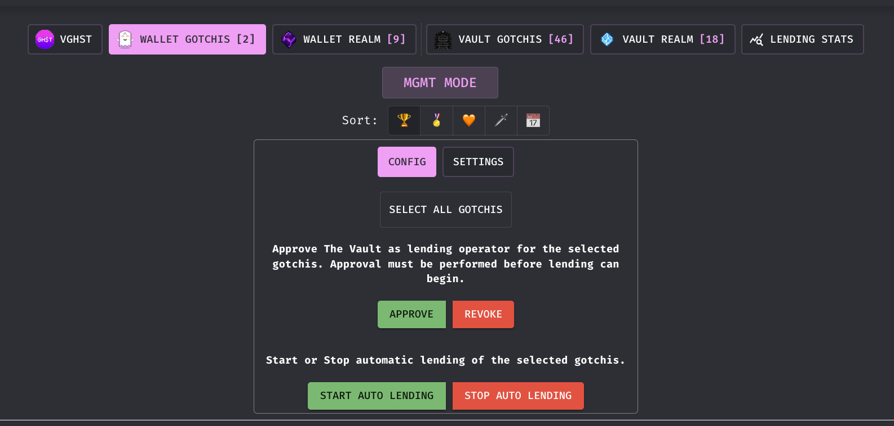

# Lending

One of the features we think provides the most value to depositors is our ability to safely automate the lending process on your behalf.

We have integrated the Aavegotchi lending contracts into the Gotchi Vault contracts, which allows us to list all of the aavegotchis in the vault on the lending market at aavegotchi.com.  Unless users opt out of this process by "pausing" their rental, we will be using bots to constantly monitor the gotchis in the Vault to determine whether they need to be listed, whether the listing needs to be modified or cancelled, and whether a rental has concluded and needs to be ended and re-listed.

.png>)

_**Pausing**_

If you don't want any of your gotchis to be lended out, you can go into our UI's "Management Mode", select the gotchis you don't want to lend, and click "Pause Selected".  This triggers an on-chain transaction indicating these gotchis shouldn't be lended.  If your gotchi is mid-rental, you'll have to wait for that rental to conclude, but your gotchi then won't be re-listed.  You can always un-pause that gotchi, by triggering the "Resume Selected" transaction.

_**Locking and guild rental**_

Regarding rentals, we have partnerships with a number of large guilds, like Crypto Gaming United, Blackpool, Orium, and Metanerd.  We have agreed to whitelist aavegotchis to these guilds.  For this to work smoothly and predictably, however, we need to ensure that the gotchis we allocate to the guilds stay in the vault for a period of time.  We're asking users to lock up their gotchis for a set period of time, during which your gotchi will be lended out to the guilds (presumably at a much higher utilization than you'd receive on the public market!).  You can lock your gotchi for a period of time using the UI.  **NOTE** that once you lock your gotchi it is **REALLY** locked for that period of time.  You will not be able to withdraw until the lock period has ended.

_**Fees**_

As lending in the Gotchiverse is brand new, we will monitor closely the market dynamics to see what the most competitive and optimal rental profit splits are.  On day 1, we'll be renting out our gotchis at a 60/30/10 split: 60% for the player, 30% for the owner, and 10% for the Vault (this 10% will be divided, as with all fees, between vGHST holders, the Vault Managers, and the vault creators/dev team).  We will also charge a 1 GHST initial cost, to ensure that renters don't borrow the gotchis and not use them.

_**Custom settings**_

.png>)

You can also choose your own settings for how your gotchi is rented out.  Modifying your gotchis rental settings will charge you a fee of 0.05 GHST per gotchi to cover gas costs.  Additionally, we will charge a 15% fee of the alchemica for gotchis that are rented through the Vault -- 5% fee to the Vault, and a 10% fee for the land owner who owns the parcel the gotchi channels on.

_**"Non-custodial" Lending Management**_

_****__****_

We know that depositing assets into a smart contract isn't for everyone.  Now, taking advance of the non-custodial "lending operator" function in Aavegotchi's smart contracts, you can manage automated lending of your gotchis without giving up custody, or the ability to transfer your assets.  First, approve the Vault's bot as a designated operator, and then modify the settings you want:

.png>)

With this option, renters won't be able to channel on the Vault's parcels, so we don't take the additional 10% of the alchemica; only a 5% fee will be deducted to cover gas costs.
